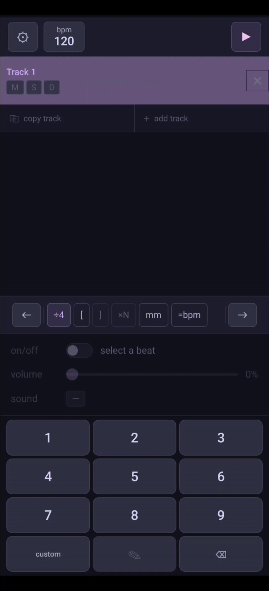

    

    <h1>Prog Metronome</h1>

---
## About
Prog Metronome is a free and open source software made by a prog metal drummer for other prog musicians who wish to practice to complex rhythmic ideas without fiddling around in DAWs. It easily allows you to do polyrhythm, polymeters, metric modulations, and more. 

Its usage is rather unconventional. See [usage](#usage) for more details .

The logo stands for a 5:4 polyrhythm/polymeter because I really like 5:4.

## Features
- Polyrhythm and polymeter
- Metric modulations and BPM changes
- Any tuplet and subdivision
- Nested pattern groupings and repeats
- Per-beat volume and sound
- Project save and export
- Custom sound import
- Custom color themes

## Supported Platforms
- Android
- IOS
- Windows (Standalone and VST3)
- Linux (Standalone and VST3)
- MacOS (Standalone and VST3)

## Download

  

  

  

##  Usage

  

Demo video: [https://youtu.be/xnNJNjJ9yNs](https://youtu.be/xnNJNjJ9yNs)

More usage examples on instagram: [https://www.instagram.com/prog_metronome/](https://www.instagram.com/prog_metronome/)

There's also a [manual explanation](./assets/help.md). This can also be found in settings in the software.

Explanation for a list of examples can be found [here](./assets/examples/examples.md). Download and load these .rhy files into the app to see them in action.

## Issues
For any issues or feedback, please submit a GitHub Issue or email prog.metronome@gmail.com

Also I'm a CS student open to full time roles starting summer 2027 I can do software and security stuff hire me plz

## Custom Themes
Prog Metronome allows custom theme colors. See [this file](./assets/custom-theme.md) for detail.

## License
Prog Metronome is [Free Software](https://en.wikipedia.org/wiki/Free_software): You can use, study, share and modify it at your will. The app can be redistributed and/or modified under the terms of the
[GNU General Public License version 3 or later](https://www.gnu.org/licenses/gpl.html) published by the 
[Free Software Foundation](https://www.fsf.org/).

## Credits
All the metronome sounds for the mobile version was found [here](https://freesound.org/people/LudwigMueller/packs/30914/) from Ludwig Peter Müller.

## Donation
If you have the ability, consider to support me at [https://ko-fi.com/prog_metronome](https://ko-fi.com/prog_metronome). All the donations will *only* go towards the annual Apple developer fees of $99 so I can keep publishing this app for IOS and MacOS.
